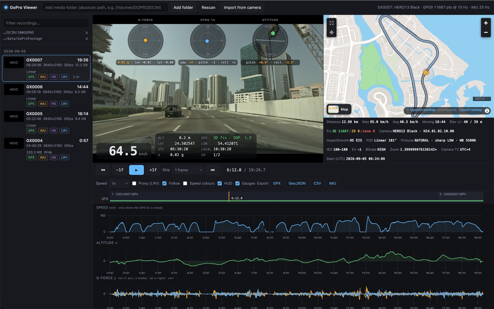
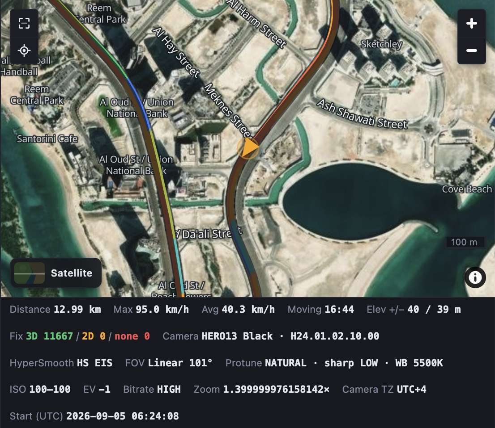
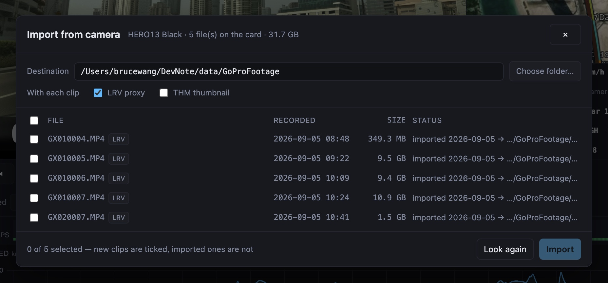

# GoPro Viewer

把 GoPro 当行车记录仪用的人需要的那个回放工具：视频和它自带的 GPS、加速度、陀螺仪数据同步回放——地图上的轨迹、画面上的速度和 G 力、下面的速度 / 海拔曲线，点哪儿跳哪儿；片子直接从相机走 USB 导进电脑。全部在本机运行，不经过任何云。

[English README](README.en.md) · 设计文档 [`docs/SPEC.md`](docs/SPEC.md)（英文）



## 为什么做这个

我把 GoPro（HERO13 Black）当行车记录仪用。用了一段时间，有三件事一直不顺手：

- **不喜欢 Quik。** 我只想看片子、看数据，不想被一个剪辑 App 牵着走。
- **导到电脑上不容易。** 相机插上 Mac 并不是一个 U 盘（默认的 GoPro Connect 模式下它是一块 USB 网卡），不是拔卡就是折腾软件，几十 GB 的素材每次都是一场仪式。
- **看视频和地图的关系不方便。** 这段画面对应地图上哪里、当时开多快、刹车有多猛——数据其实都在 MP4 里（GoPro 的 GPMF 遥测流），但没有一个顺手的工具把它们放在一起看。

所以决定自己做一个：只做回放和导入，把视频、地图、数据放在一个页面里，一条时间轴。

## 这个工具是怎么做出来的

整个工具是用 Claude（Claude Opus 5 和 Claude Fable 5.1）完全通过聊天做出来的——从第一行代码到这份 README 和这几张截图，全部在聊天窗口里完成，每次提交的 Co-Authored-By 都如实写着是哪个模型。我提需求、提意见、拍板；它做设计、写代码、写测试，在我的 Mac 上连着真机验证（试相机的 USB 接口、在 Chrome 里截图核对界面），然后提交。66 个自动化测试和 ESLint 的规矩（函数不超过 50 行、圈复杂度不超过 15、不留死代码）也是这么定下来的。

分享出来，给同样拿 GoPro 当行车记录仪、又不想用 Quik 的兄弟。MIT 协议，随便用、随便改。

## 截图



卫星底图（Esri 影像）叠加地名 / 道路标注，轨迹按速度着色，箭头是当前位置；下方是这段录像的统计和相机设置。



从相机导入：USB 直连，列出卡里的片段；导过的写明哪天导到了哪里，不再自动勾选。

## 功能一览

- **同步回放**：视频、地图、HUD、曲线共用一条时间轴。点地图上的轨迹、点曲线、点时间轴都能跳转，曲线上拖动可以放大。同一段录像的分段文件（GX01xxxx、GX02xxxx…）自动合并成一条。
- **画面上的数据**：HUD 显示速度、海拔、经纬度、定位状态（2D / 3D、DOP）、UTC 和本地时间、当前 G 值；三个仪表——G 力球（加速 / 刹车 / 转弯）、陀螺球（转向率、俯仰率、横滚率）、姿态泡（俯仰和横滚）。相机歪着装、倒着装都行，"上"是量出来的，不是假设的。
- **曲线**：速度、海拔、G 力（纵向 / 横向 / 垂直）、陀螺仪。速度只在定位稳定的区段显示，弱信号下的假速度不会画出来。
- **地图**：OpenStreetMap 街道底图和 Esri 卫星影像（可叠加地名 / 道路标注），不需要任何 key；轨迹分已走 / 未走，可按速度着色；可以跟随当前位置，也可以一键回到全程。
- **从相机导入**：USB 直接列出卡里的内容，按录制日期分目录，导完可选择从相机删除；导过的片段有台账，不会重复导入，需要时手动重导。详见下面。
- **导出**：GPX、GeoJSON、CSV（每个 GPS 采样点）、IMU CSV（25 Hz 加速度），另有命令行工具批量提取。
- **本机运行**：服务只监听 `127.0.0.1`，视频和数据不出电脑，只有地图瓦片需要联网。macOS 上可以开机自启，并装成 Chrome 桌面应用。

## 快速开始

需要 Node.js 20 或更新（22、24 上测过）。

```bash
git clone https://github.com/brucewang1223-beep/gopro-viewer.git
cd gopro-viewer
npm install
npm start -- --media /Volumes/GOPRO/DCIM      # 换成你放 GoPro 视频的目录，可以给多个
# 打开 http://127.0.0.1:8790
```

也可以启动后在页面顶部 **Add folder** 添加目录（会存进 `config.json`），或者照着 `config.example.json` 写一个 `config.json`。所有参数：`npm start -- --help`。

手头没有素材想先看看效果：`npm run samples` 把 GoPro 官方的样片下载到 `samples/`，然后 `npm start -- --media samples`。

关于浏览器：HERO 系列默认录的 HEVC（`GX…` 文件）在 Safari 里能放，Chrome 在 Apple Silicon 的 Mac 上能放（其他平台取决于有没有硬解）；H.264（`GH…` 文件）哪儿都能放。放不了的时候勾上 **Proxy (LRV)**，用相机自带的低清代理文件回放（导入时默认会一起带过来），遥测数据完全一样。

macOS 上开机自启：`npm run autostart`（launchd 代理，崩了自动拉起；`npm run autostart:status` 看状态，`npm run autostart:remove` 卸载）。服务常驻之后，在 Chrome 里打开 http://127.0.0.1:8790 → ⋮ 菜单 → *Cast, save and share* → *Install page as app…*，就有了独立窗口和 Dock 图标。

## 从相机导入

1. 相机里 Preferences › Connections › USB Connection 选 **GoPro Connect**（出厂默认就是）。这个模式下相机插上电脑不是 U 盘，而是一块 USB 网卡，工具通过 Open GoPro 的 HTTP 接口和它对话。
2. USB 线插上，点页面顶部的 **Import from camera**。对话框列出卡里的所有片段：新的默认勾上，导过的不勾（状态一栏写着哪天导到了哪里）。
3. **Choose folder…** 弹出 macOS 自己的文件夹选择面板，选目标目录（记住上次的选择）。每个片段可以带上 **LRV** 低清代理（默认勾选，HEVC 放不了时靠它）和 **THM** 缩略图（默认不勾）。
4. **Import**。文件按录制日期放进 `<目标目录>/<YYYY-MM-DD>/`，逐个按字节数校验，导完目标目录自动加入媒体库。可以关掉对话框继续看片子，状态栏会跟着进度；**Stop** 随时中断，没传完的文件下次接着传。
5. 导完会问一句：要不要把刚导入的片段从相机上删掉（LRV、THM 一起删）。**Keep on camera** 就什么都不动。只有这次完整导入的片段才会出现在删除列表里。

导过的记录存在 `import-ledger.json` 里：即使本地文件后来删了，也不会被自动再导一遍；想重导，手动勾上即可（本地还完整的会直接校验通过，不重新下载）。

速度：HERO13 走的是 USB 2.0，实测 43 MB/s 左右，33 GB 大约 13 分钟。

对话框显示 **No camera**：相机休眠了、USB 模式设成了 MTP、或者有别的程序（MacDroid、adb 之类）占着 USB 设备——唤醒、改模式、退掉那个程序，再点 **Look again**。

## 地图

默认（`"map": { "provider": "osm" }`）用 OpenStreetMap 的数据：矢量瓦片来自 [OpenFreeMap](https://openfreemap.org)（全球到 14 级，不要 key、不限量），卫星视图是 Esri World Imagery 加同一套标注叠加层，浏览器直接取瓦片，服务端不经手。底图卡片在地图左下角，`B` 键切换；卫星视图上的 **Labels** 开关控制标注层。选择记在浏览器里，`config.json` 只决定第一次打开的默认值。

`"provider": "k2"` 把同样两套样式切到 K2 地图服务（map.lumobility.com，阿联酋范围内细节更好），需要在 `config.json` 的 `map` 里填 token——token 只在服务端签名，不会发到浏览器。OSM 样式是从 K2 样式派生的（`node scripts/make-osm-styles.js`），改了 K2 样式重跑一次，测试会检查派生文件有没有过期。

## 导出

选中一段录像，控制栏的 Export：**GPX**（有定位的轨迹点，含海拔、时间、速度）、**GeoJSON**（每段连续定位一条 LineString，带统计和相机设置，QGIS / kepler.gl / geopandas 直接打开）、**CSV**（每个 GPS 采样点，含定位状态和 DOP）、**IMU**（25 Hz 加速度 CSV）。

命令行批量提取（多个文件视为同一段录像的连续分段）：

```bash
node scripts/dump-telemetry.js GX010042.MP4 GX020042.MP4 --format gpx --out ride.gpx
node scripts/dump-telemetry.js GX010042.MP4 --format csv          # GPS 表，直接喂 pandas
node scripts/dump-telemetry.js GX010042.MP4 --format csv-accl     # 25 Hz 加速度
node scripts/dump-telemetry.js GX010042.MP4                       # 完整 JSON（和 API 一样）
```

## 快捷键

| 键 | 作用 |
| --- | --- |
| `Space` | 播放 / 暂停 |
| `←` / `→` | 按 Skip 步长后退 / 前进（默认 5 秒；可选 1/2/5/10 帧或 1–60 秒；按住 `Shift` ×6） |
| `,` / `.` | 上一帧 / 下一帧 |
| `[` / `]` | 上一段 / 下一段 |
| `Home` / `End` | 开头 / 结尾 |
| `M`（或 `L`） | 地图跟随开关 |
| `F` | 地图缩放到全程 |
| `B` | 切换底图（街道 ↔ 卫星） |
| `H` | 显示 / 隐藏 HUD |
| `G` | 显示 / 隐藏仪表 |
| 双击视频 | 全屏 |

## 已知限制

- 只在 macOS + HERO13 Black 上验证过。GPMF 遥测格式各代 GoPro 通用（测试用例里就有官方样片），其他型号大概率能放，但导入没有在别的相机上试过。
- 选目标目录的面板是 macOS 的。服务跑在别的系统上时，把目标目录写进 `config.json` 的 `import.dest`，其余步骤照旧。
- 侧栏里的录制时间按 UTC 显示（HERO13 写进文件头的就是 UTC）；HUD 里同时有 UTC 和本地时间，导入对话框显示的是相机本地时间。
- 视频始终静音：这是看数据的工具，不是播放器。
- 地图瓦片来自公共服务（OpenFreeMap、Esri），需要联网；其余功能离线可用。

## 项目结构与开发

```
server/   Node 服务：MP4 解析（只读 moov）、GPMF 解码、媒体库扫描、HTTP API、导出、相机导入
web/      浏览器界面：原生 ES 模块，没有构建步骤；styles/ 是 MapLibre 样式
tests/    node --test 测试 + 5 秒的 GoPro 样片 + 一个假相机（导入测试用）
scripts/  命令行提取、样片下载、macOS 自启、OSM 样式派生
docs/     SPEC.md（设计与决策）、screenshots/
```

```bash
npm test          # 66 个测试
npm run lint      # ESLint
npm run dev       # 带 --watch 的服务
```

## 致谢

遥测解码 [gopro-telemetry](https://github.com/JuanIrache/gopro-telemetry)（MIT），海拔校正 egm96-universal，地图渲染 MapLibre GL JS，底图数据 OpenStreetMap 贡献者与 OpenFreeMap，卫星影像 Esri，K2 Maps（map.lumobility.com），曲线 uPlot。测试样片来自 gopro/gpmf-parser（Apache-2.0）。

MIT 协议。如果你也拿 GoPro 当行车记录仪，希望它能帮到你。
